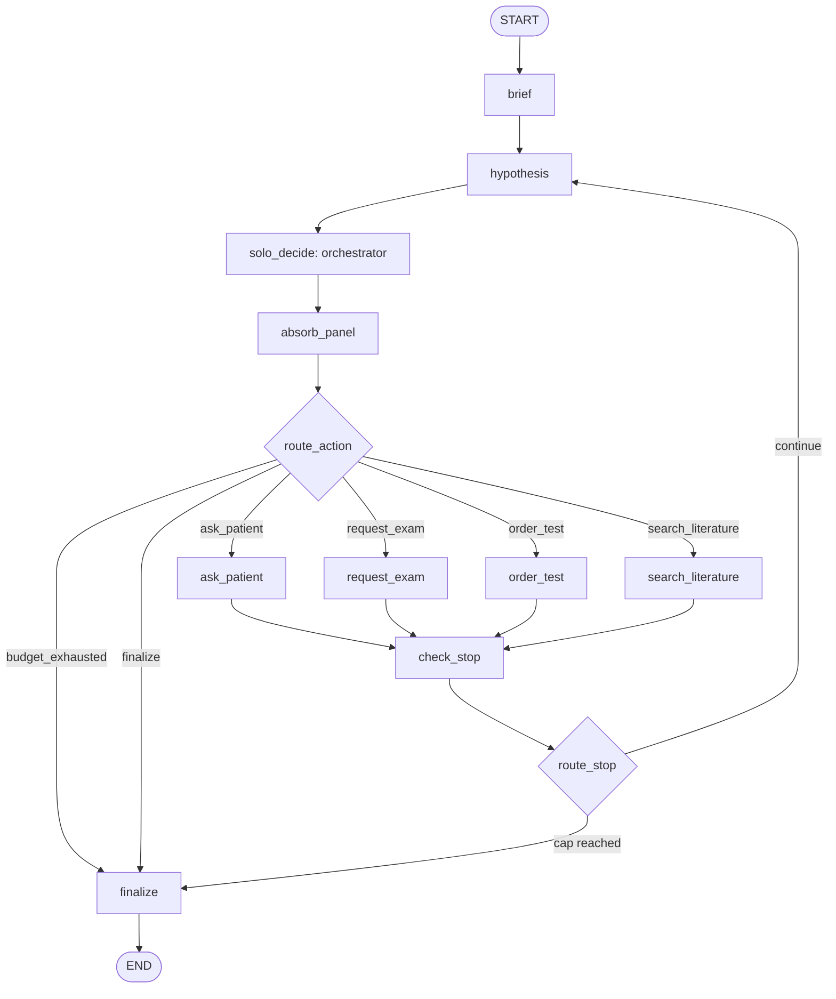
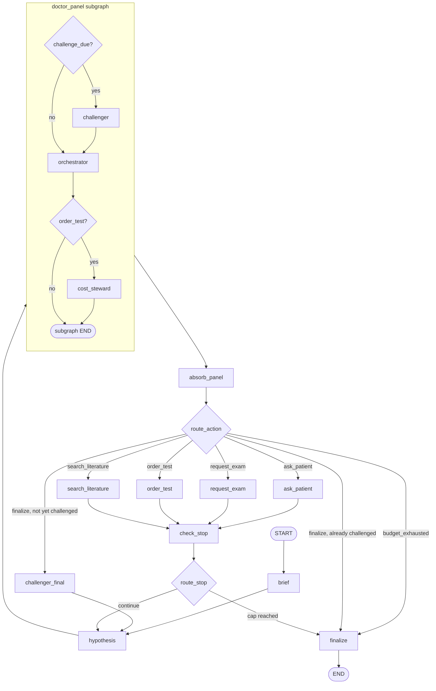

# PLAN — AgentClinic-from-scratch

**Revision 4** (2026-09-15) — incorporates three adversarial review rounds:
`docs/PLAN_REVIEW.md` (24 findings), `docs/PLAN_REVIEW_2.md` (17),
`docs/PLAN_REVIEW_3.md` (21), and decisions D-025 … D-038.

Revision 4 **removes** two nodes rather than adding machinery: `challenger_stop`
(which could not affect any output) and `rp` (an unbounded re-prompt cycle).

Every choice traces to `docs/DECISIONS.md` (`D-nnn` / `Q-nn` / `Q2-nn`) or an
explicit requirement in `docs/BRIEF.md` (`§n`). §8 is empty.

**Educational simulation only.** Not medical advice, never real patient data
(§2). Disclaimer in `README.md` and CLI startup output.

---

## 1. Architecture overview

### 1.1 The isolation property (D-019 Q-09, §5)

The case lives in a `CaseStore` **outside** the graph; each node is closed over
a narrow view. Views are injected **by closure**, never through
`config["configurable"]` — LangGraph records config in checkpoint metadata, and
§5 forbids ground truth reaching a checkpoint.

```
   CaseStore (outside graph, full Case)
        ├── PatientView      Patient_Actor (+ undocumented keys, D-018)
        ├── GatekeeperView   Physical_Examination_Findings + Test_Results
        ├── DoctorView       Objective_for_Doctor
        └── JudgeView        Correct_Diagnosis + Management_and_Follow_Up
```

**The property, stated precisely:**

> No `EncounterState` key is ever **written from** `Case.Correct_Diagnosis` or
> `Case.Management_and_Follow_Up`, because no doctor-side view exposes them.

Deliberately narrower than "the diagnosis never appears in state", which is
**false** for 29 cases and unachievable (§3.2). Enforced by four tests (§3.3).

### 1.2 Graphs

| Graph | Deliberation | Sub-roles |
|---|---|---|
| `single_doctor` | `hypothesis` (parent) → `solo_decide` subgraph: `orchestrator` | — |
| `encounter` + `doctor_panel` | `hypothesis` (parent) → `doctor_panel` subgraph: `[challenger] → orchestrator → [cost_steward]` | **challenger, cost-steward** |
| `judge` | separate graph, run by the eval runner (Q-21) | — |

`hypothesis` sits in the **parent** of both graphs (review B-7). The graphs are
**not** identical beyond the two sub-roles, and §9 R10 says so plainly
(review C-8). The actual differences are:

1. the panel runs `challenger` on every 3rd turn and `cost_steward` before each
   `order_test`, both advisory (D-025);
2. the panel runs `challenger_final` before a *voluntary* finalize, granting one
   re-deliberation;
3. the panel therefore makes 1–3 more LLM calls per turn.

The comparison isolates "does a doctor that receives challenge and cost opinions
decide differently", **not** "do panels beat individuals" in general. Brief
§5.3's Test-selection role is merged into
`OrchestratorDecision.expected_information` (D-026, recorded deviation).

---

## 2. LangGraph design

### 2.1 `EncounterState`

```python
class EncounterState(TypedDict):
    case_id: str
    objective: str                                    # never truncated
    turn: Annotated[int, operator.add]
    action: str | None                                # validated against the per-run set (C-14)
    action_argument: str | None
    encounter_log: Annotated[list[Event], operator.add]
    panel_events: list[Event]                         # subgraph → parent handoff
    challenger_opinion: ChallengerOpinion | None      # typed channel (C-2)
    cost_objection: CostStewardOpinion | None         # typed channel (C-2)
    summary: EncounterSummary
    differential: list[DifferentialItem]
    red_flags: list[RedFlag]
    challenged_this_finalize: bool
    budget_exhausted: bool
    spend_usd: float                                  # snapshot; client owns the total (C-9)
    test_cost_usd: Annotated[float, operator.add]
    parse_failures: Annotated[int, operator.add]
    stop_reason: StopReason | None
    final: FinalAnswer | None
```

**Writer and value-semantics table.** This list is **exhaustive**: every
`Event.kind` in §4.1 has an emitting node here, and a test asserts that (C-5).
It is reconciled row-by-row with §3.1's matrix.

| Key | Writer(s) | Reducer | Semantics |
|---|---|---|---|
| `case_id`, `objective` | `brief` | last-write | absolute, written once |
| `encounter_log` | `brief` (`objective`), `hypothesis` (`hypothesis`, `red_flag`), action nodes (`question`/`answer`/`exam`/`test`/`literature`/`unlisted_test`), `absorb_panel` (subgraph transcript), `challenger_final` (`challenge`), `check_stop` (`budget`, cap events), `finalize` | `operator.add` | **delta** — never return the accumulated list |
| `panel_events` | panel subgraph (append, `operator.add` **inside** the subgraph — C-6); `absorb_panel` resets to `[]` (C-7) | last-write in the parent | absolute, one deliberation |
| `challenger_opinion` | `challenger` (in-subgraph), `challenger_final` (parent); action nodes clear to `None` | last-write | absolute |
| `cost_objection` | `cost_steward`; action nodes clear to `None` | last-write | absolute |
| `summary`, `differential`, `red_flags` | `hypothesis` | last-write | absolute |
| `action`, `action_argument` | `orchestrator` | last-write | absolute |
| `turn` | `check_stop` | `operator.add` | **delta** `+1` per executed action |
| `challenged_this_finalize` | `challenger_final` → `True`; action nodes → `False` | last-write | absolute |
| `budget_exhausted` | `@budget_guarded` on any LLM node | last-write | absolute |
| `spend_usd` | `check_stop` (snapshot read from the client) | last-write | absolute |
| `test_cost_usd` | `order_test`, `request_exam` | `operator.add` | **delta** |
| `parse_failures` | every LLM node | `operator.add` | **delta** |
| `stop_reason` | `check_stop` (cap reasons); `@budget_guarded` (`"budget_exhausted"`); `finalize` (`"finalize"` **only if still `None`**) | last-write | absolute |
| `final` | `finalize` | last-write | absolute |

`turn` is incremented by `check_stop`, which runs exactly once per executed
action in both graphs. The cap is evaluated on the **post-increment** value, so
`turn == 20` is the twentieth executed action and the encounter finalizes after
it (C-16).

**Spend accounting** (C-9): the **OpenRouter client owns the authoritative
running total** and is the only thing that raises `BudgetExceeded`.
`EncounterState.spend_usd` is a reported snapshot refreshed by `check_stop`; it
is never the value the cap is tested against. This removes the two-accumulator
race and the double-counting risk of an `add` reducer on the same quantity.

### 2.2 `single_doctor`



`absorb_panel` is present in both graphs (C-13) because `solo_decide` declares
the same output schema; keeping it makes the two paths identical up to the
sub-role nodes.

### 2.3 `encounter` + `doctor_panel`



**Two nodes were deleted in revision 4.**

- **`challenger_stop`** (C-1). It ran on the cap path, produced an opinion, and
  its only edge led to `finalize`, which reads `differential` and `summary` — not
  the opinion. It could not affect any output. Q-16's "challenger before every
  finalize" therefore **does not hold on the cap path**; that is a recorded
  amendment (D-038), defensible because the budget is already spent and the
  opinion could change nothing.
- **`rp`** (C-3). The `route_action → rp → subgraph` cycle touched `check_stop`
  on no iteration, so neither the turn cap nor the spend cap could fire inside
  it, and its only claimed bound was a run-cumulative counter shared with every
  other node. A valid-but-disabled action is simply invalid output and is
  repaired **inside** the orchestrator node by Q-15's 3-attempt loop, where the
  attempt counter is a local variable and no cycle exists.

**Routing priority in `route_action`** — evaluated in this order (C-4):

1. `budget_exhausted` → `finalize` (structural, not a decorator side effect)
2. `action == "finalize"` and `challenged_this_finalize` → `finalize`
3. `action == "finalize"` and not challenged → `challenger_final`
4. otherwise → the named action node
5. an unknown value → `RoutingError`

**Termination of the finalize path** (B-1, C-1). `route_action` branches on
`challenged_this_finalize` **before** `challenger_final` runs, so the flag is
read pre-write. `challenger_final` writes a typed `challenger_opinion` **and**
appends a `kind="challenge"` event, then returns to `hypothesis`, which folds
the challenge into `summary.open_questions`. The re-deliberation therefore sees
information it did not have before — the defect C-1 identified, where the
orchestrator re-decided on an identical input one boolean apart, is closed. Any
executed action clears both the flag and the opinion.

**Subgraph schemas** (B-2, B-7, C-2):

```
input_schema : objective, summary, differential, red_flags, turn,
               challenged_this_finalize, budget_exhausted, challenger_opinion
output_schema: action, action_argument, challenger_opinion, cost_objection,
               panel_events, spend_usd, parse_failures, budget_exhausted
```

`encounter_log` is **absent from both**, which is what makes per-node isolation
structural: the orchestrator, challenger and cost-steward cannot read raw event
text. The opinions reach the orchestrator through **typed keys**, not free-text
events (C-2) — so §3.3's prompt test remains writable and true, scoped to event
text originating **outside** the subgraph. `panel_events` is purely the
transcript that `absorb_panel` folds into `encounter_log`; inside the subgraph it
carries an `operator.add` reducer so the challenger's, orchestrator's and
cost-steward's events accumulate rather than overwrite each other (C-6), and
`absorb_panel` resets it to `[]` so a no-op deliberation cannot re-absorb the
previous one (C-7). `case_id`, `test_cost_usd`, `stop_reason` and `final` never
cross either way. `solo_decide` declares the same schemas minus the opinion keys.

`challenge_due` = `turn % 3 == 0 and turn > 0 and not challenged_this_finalize`.
The final clause is intentional: it prevents the scheduled challenger firing in
the same turn as `challenger_final` (C-17).

The cost-steward reasons from `config/test_costs.yaml` and the proposed test
name only — it has no budget state, by design.

### 2.4 `judge` graph

One node, one call: `match_diagnosis` returns `match_type` **and**
`entry_matches: list[bool]`, so top-k and `judge_correct` share one equivalence
judgement. Built by the eval runner from `JudgeView` after the encounter
returns. `AsyncAnthropic`. Not called when `abstain` (D-028). Capped at **200
calls per run** (D-037).

## 3. Visibility

### 3.1 Matrix

| Node | `Objective` | `Patient_Actor` | `Physical_Exam…` | `Test_Results` | `Mgmt_Follow_Up` | `Correct_Diagnosis` | `encounter_log` |
|---|---|---|---|---|---|---|---|
| `brief` | ✅ | — | — | — | — | — | write-only |
| `hypothesis` | via state | — | — | — | — | — | ✅ read + append |
| `orchestrator` | via state | — | — | — | — | — | **—** |
| `challenger` (in-subgraph) | via state | — | — | — | — | — | **—** |
| `challenger_final` (parent) | via state | — | — | — | — | — | append |
| `cost_steward` | via state | — | — | — | — | — | **—** |
| `ask_patient` | — | ✅ | — | — | — | — | append |
| `request_exam` | — | — | ✅ matched sub-tree | — | — | — | append |
| `order_test` | — | — | — | ✅ matched sub-tree | — | — | append |
| `search_literature` | — | — | — | — | — | — | append |
| `check_stop`, `absorb_panel` | — | — | — | — | — | — | append |
| `route_action`, `route_stop` (routers) | — | — | — | — | — | — | — |
| `finalize` | via state | — | — | — | — | — | append |
| `match_diagnosis` (judge) | — | — | — | — | ✅ | ✅ | — |

### 3.2 The leak isolation cannot close

**D-015.** The diagnosis is embedded in `Test_Results` — data the gatekeeper is
designed to return. It appears in **zero** `Physical_Examination_Findings`.

```python
def dx_in_results(case) -> bool:                      # verified: fires on 29 cases
    dx = normalise(strip_trailing_parenthetical(case.correct_diagnosis))
    return bool(dx) and dx in normalise(" ".join(flatten_keys_and_values(
        case.test_results, case.physical_examination_findings)))
# normalise: casefold, "_" -> " ", collapse whitespace
```

Keys must be matched — the gatekeeper returns key *and* value, and case 154
(`Varicella`) has the key `Varicella_Specific_Tests`. The trailing parenthetical
must be stripped — case 104 is `Legg-Calvé-Perthes disease (LCPD)`. Counts: 27
values-only, 28 keys+values, **29** with both. Leak-free denominator **185**.
The count is **computed and pinned by a test**, never hard-coded elsewhere.

Secondary metric `dx_tokens_in_results`: **all** diagnosis tokens present at
word boundaries, no stopword list, no minimum length, full string absent.
Verified **4** cases — 13, 34, 123, 208 *(corrected from 5; case 182
`Acute Hepatitis B` has neither "acute" nor a standalone "B" in its results,
review B-12)*. Pinned by a test like `dx_in_results`.

### 3.3 Enforcement in code

1. `CaseStore` exposes no method returning a full `Case`; `Correct_Diagnosis`
   and `Management_and_Follow_Up` appear on no view but `JudgeView`.
2. Closure binding — each node holds only its own view.
3. **Five tests**, each assigned to the earliest phase in which its
   artefacts exist (C-12):
   - *View test* (**Phase 1**) — `DoctorView`/`PatientView`/`GatekeeperView` expose no
     attribute derived from the two hidden fields.
   - *Allow-list test* (**Phase 1**) — every `EncounterState` key paired with its declared
     source; fails when a key is added without one.
   - *String-scan test* (**Phase 3**, needs a full scripted encounter) — over `[c for c in cases if not c.dx_in_results]`,
     asserts absence from every doctor-side prompt, state channel and
     checkpoint, at start and after a scripted encounter (§11).
   - *Positive test* (**Phase 2**, needs the gatekeeper) — asserts the diagnosis **is** in gatekeeper output for the
     29 flagged cases, so changing the flag breaks loudly.
   - *Prompt test* (**Phase 3**, needs the LLM orchestrator) — the orchestrator's
     rendered prompt contains no substring of any `Event.text` **that originated
     outside the subgraph** and is absent from `summary` (C-2).
4. **Checkpoints.** No checkpointer in batch runs (Q-30). Interactive mode's
   `MemorySaver` holds `EncounterState`, which for the 29 flagged cases **does**
   contain the diagnosis inside `encounter_log` — so the brief §11 checkpoint
   test is scoped to leak-free cases exactly like the string scan. *(This
   sentence previously claimed the checkpoint was "ground-truth-free", the same
   discredited wording §1.1 was corrected away from — review B-15.1.)*
5. Judge separation (Q-21) — `JudgeView` built after the encounter ends.
6. Gatekeeper returns the matched key and its sub-tree only (§4.2).
7. Evidence agent sees only the query string, never `case_id`.
8. **Trace separation.** Judge traces and **judge exceptions** go to
   `judge.jsonl` only. Tracebacks are never written to `traces/<case_id>.jsonl`
   or `results.csv` — an `AsyncAnthropic` error can carry the `JudgeView` prompt
   (review B-17). Those files record an exception *type and message* only.

---

## 4. Schemas and protocols

### 4.1 Structured outputs

The chosen model advertises `tools`, `structured_outputs` and `response_format`
at its single endpoint (D-030). **Phase 1 runs a live spike** to confirm, and to
check whether `usage.cost` populates for `:free` models. The fallback ladder
(strict → `response_format` JSON mode → prompt-and-parse with the Q-15 repair
loop) is a **per-run** decision, resolved once by the spike and recorded in run
metadata, so a run is internally comparable (review B-8).

```python
# Action set is built PER RUN (review B-8) — not a static Literal.
def make_action_type(enabled: frozenset[str]) -> type:
    return Literal[tuple(sorted(enabled))]           # type: ignore[valid-type]

def make_orchestrator_decision(enabled: frozenset[str]) -> type[BaseModel]:
    return create_model("OrchestratorDecision",
        action=(make_action_type(enabled), ...),
        argument=(str, ...), reason=(str, ...), expected_information=(str, ...))
# search_literature is in `enabled` only when the evidence agent is on for the
# run. A valid-but-disabled action is invalid output and is repaired INSIDE the
# orchestrator node by Q-15's 3-attempt loop (C-3, C-15) -- route_action is a
# pure router and writes no state.

class Event(BaseModel):
    turn: int
    kind: Literal["objective","question","answer","exam","test","literature",
                  "hypothesis","challenge","cost_objection","red_flag",
                  "unlisted_test","parse_failure","budget"]
    actor: Literal["doctor","patient","gatekeeper","evidence","system"]
    text: str
    meta: dict[str, str] = {}                        # match_tier, test_cost, …

class RedFlag(BaseModel):
    concern: str
    turn: int

class EncounterSummary(BaseModel):                   # Q-29; each field ~2000 chars
    findings: list[str]                              # hypothesis, from encounter_log
    tests_ordered: list[str]                         # hypothesis, from encounter_log
    ruled_out: list[str]                             # from HypothesisUpdate
    open_questions: list[str]                        # from HypothesisUpdate

StopReason = Literal["finalize","turn_cap","spend_cap","request_cap","budget_exhausted"]
# `crash` is a runner-level OUTCOME, not a stop reason: the graph raised, so
# finalize never ran and stop_reason is None (review B-3).

class DifferentialItem(BaseModel):
    diagnosis: str
    probability: float = Field(ge=0, le=1)           # not forced to sum to 1
    rationale: str

class HypothesisUpdate(BaseModel):
    differential: list[DifferentialItem] = Field(max_length=8)
    ruled_out: list[str]
    open_questions: list[str]
    red_flags: list[RedFlag]                         # model-reported only (D-027)

class PatientReply(BaseModel):
    reply: str
    unknown: bool                                    # Q-10

class ChallengerOpinion(BaseModel):                  # advisory (D-025)
    argument_against_leader: str
    most_dangerous_unexcluded: str

class CostStewardOpinion(BaseModel):                 # advisory (D-025)
    objection: str | None
    would_change_management: bool

class FinalAnswer(BaseModel):
    diagnosis: str                                   # "" when abstain (D-028)
    differential: list[DifferentialItem] = Field(max_length=8)
    confidence: float = Field(ge=0, le=1)
    abstain: bool
    red_flag: list[RedFlag]
    rationale: str

class JudgeVerdict(BaseModel):
    match_type: Literal["exact","synonym","broader","narrower","wrong"]
    entry_matches: list[bool]
    reasoning: str
# judge_correct = match_type in {"exact","synonym"}; lenient = != "wrong" (Q-22)
```

**Invalid output** (Q-15): 3 attempts (initial + 2 repairs), then forced
`finalize` with `abstain=true` and outcome `error`.

### 4.2 Gatekeeper matching (Q-11, D-034, D-035)

Cascade, logging the tier: **exact (normalised) → curated synonym table → LLM
fallback over key names only**. The `rapidfuzz` tier is **dropped** (D-034) — it
had no threshold, no labelled tuning set, and no objective that did not trade
match rate against wrong-key matches, which brief §5.2 forbids.

**Granularity.** Match at the **top level**; return that key and its complete
sub-tree — that *is* ordering a panel. A request naming a leaf matches its
parent. **Ambiguous leaves** (D-035): verified that 58/214 cases have a leaf
under more than one top-level key and **9** of those are real analytes (`WBC`
under `Complete_Blood_Count` *and* `Urinalysis` in cases 10, 38, 55, 80, 101;
`Na`/`Glu` in 29; `Bilirubin` in 58; `Glucose` in 66; `WBC` under CBC and a
joint aspirate in 30). The LLM tier selects one parent from the key names and
that sub-tree alone is returned, logged as tier `llm_disambiguated`. Returning
every match would disclose tests the doctor never ordered (§5.2).

**Value types.** `str | dict | list` at every level: 16 cases have top-level
string values in `Test_Results` (2 all-string 150/187, 14 mixed), 2 contain
lists (153, 185), and **`Physical_Examination_Findings` contains lists in cases
37 and 103** (review B-15.4) — `request_exam` walks PEF, so that path needs the
same handling.

**Unlisted** (Q-12): `"Not available for this patient"`, **still charges the
cost**, logs `unlisted_test`. The 4 empty-`Test_Results` cases always take this
path and are covered by unit tests (D-029).

---

## 5. Episode loop, stop conditions, budgets

1. Runner loads the case, builds views, compiles the graph for that case.
2. `brief` writes `objective` (never truncated).
3. `hypothesis` → decide → route → act → `check_stop`.
4. **Stop conditions — all produce a `FinalAnswer`:**

| Condition | Value | Written by | Source |
|---|---|---|---|
| `finalize` chosen | — | `finalize` (if `stop_reason is None`) | orchestrator |
| `turn_cap` | **20** (CLI 10 for dev) | `check_stop` | Q-24 |
| `spend_cap` | **$0.50**, `spend_usd` only | `check_stop` | Q-25 |
| `request_cap` | remaining daily allowance | `check_stop` | review #13 |
| `budget_exhausted` | spend cap hit mid-call | `@budget_guarded` | review C-4 |
| Confidence threshold | **none** | — | Q-26 |

   `check_stop` is a **node**, not a routing function, so it can write
   `stop_reason`; `route_stop` reads it (review B-3). It is closed over the
   shared rate/daily guard object, which is how it can evaluate `request_cap` —
   a process-global condition not present in state (C-19). `test_cost_usd` is a
   simulated metric, never compared against the spend cap.
   **`forced_stop`** is defined as `stop_reason not in (None, "finalize")`
   (C-11).
5. **Budget handling** (review B-4). A `@budget_guarded` decorator wraps **every**
   LLM-calling node — `hypothesis`, `orchestrator`, `challenger`,
   `challenger_final`, `cost_steward`, `ask_patient`,
   `finalize`, and the gatekeeper's LLM tier. It converts `BudgetExceeded` into
   a state update setting `budget_exhausted=True` with no further call. When set:
   both challenger nodes are skipped, and `finalize` is constructed **in Python**
   from the existing `differential` with no model call.
6. **Recursion limit** = `max_turns * 6 + 20` (140), derived in code (Q-27).
7. **Red flags** — model-reported only (D-027). `red_flag_turn` is derived from
   the append-only `encounter_log`, not from `red_flags`.
8. **Context** (Q-29): the doctor sees `EncounterSummary`; raw messages live in
   traces and are never resent — enforced structurally by the subgraph schemas
   (§2.3), not by prompt discipline. Each summary field is capped at ~2000
   characters, **oldest entries dropped first, and every drop logged as an
   `Event`** so the loss is visible in the trace (C-18).
9. **Checkpointing** (Q-30) / **HITL** (Q-31, D-032): `MemorySaver` and
   `interrupt()` at the orchestrator, interactive mode only.
10. **Crash handling.** `route_action` raises `RoutingError` only on a genuinely
    unknown value. The runner catches per-case exceptions, records outcome
    `crash` with the exception type and message (**not** the traceback — review
    B-17), writes partial results, and continues.

### 5.1 Budgets, pacing, run modes

| Guard | Value |
|---|---|
| Spend per case / run | $0.50 / $25, on `spend_usd` (Q-25) |
| Rate limit | global token bucket, **18 req/min** (D-023) |
| Daily cap | persistent UTC-dated counter, **1000 req/day** (review #13) |
| Pre-flight | refuses runs projected over spend **or** remaining daily requests |
| Concurrency | 4 workers sharing both guards (D-023) |
| Retries | 3, backoff 1/2/4s + jitter, 120s timeout (Q-08) |
| Judge | exempt from the above (D-021); **200 calls/run** (D-037) |

429s are classified minute-cap vs daily-cap from the response. A **minute-cap**
429 is retried; because the 7s retry budget cannot span a 60s window, the token
bucket — not the retry loop — is the real protection. A **daily-cap** 429
aborts the run cleanly with partial results written, rather than degrading case
by case into `error` outcomes that silently shrink the denominator.

**Run modes** (review B-16, D-030):

| Mode | Report | Cache | Provider |
|---|---|---|---|
| Reported run (default) | `report.md` + `results.csv` | disabled by a code-level assertion (Q-34) | pinned `order: ["Nvidia"]`, `allow_fallbacks: false` |
| `--no-report --cache` | neither written | enabled | fallbacks permitted — though the model has exactly one endpoint, so this buys nothing today |

The mode is recorded in run metadata.

---

## 6. Evaluation

### 6.1 Splits (Q-36, D-024)

**Grouped, not stratified** — no `Correct_Diagnosis` in both splits.

```python
key    = lambda dx: " ".join(dx.strip().lower().split())   # case-insensitive
groups = {key(dx): [case_ids]}      # 177 groups; 35 hold 2–3 cases (72 cases)
ordered = sorted(groups)
random.Random(20260915).shuffle(ordered)
dev = []
for k in ordered:
    if len(dev) + len(groups[k]) <= 40: dev += groups[k]
assert len(dev) == 40                                       # review B-14.2
heldout = sorted(set(all_ids) - set(dev))
json.dumps({"dev": sorted(dev), "heldout": heldout}, sort_keys=True, indent=2)
```

*The comment previously read "35 groups over 72 cases" — that is the count of
**multi-case** groups; there are **177** in total, and building `groups` from
duplicates only would produce a different, permanently committed split
(review B-14.1).* Case-insensitive keys are required: 31 duplicate strings over
63 cases raw, but **35 over 72** normalised. Verified to produce exactly
dev 40 / heldout 174. Serialisation is specified above so the byte-for-byte
regeneration test has defined bytes (review B-14.3). Committed (D-006), never
regenerated. Held-out runs only with `--split heldout` (§8).

### 6.2 Current scope (D-022, D-029)

**3 cases** from dev: the lowest-`case_id` case with `dx_in_results == True`,
then the lowest-`case_id` remaining. Verified to yield **`medqa-0002`
(flagged), `medqa-0009`, `medqa-0012`**.

> **This validates the harness; it does not measure anything.** At n=3 the only
> attainable accuracies are 0, 33, 67 and 100%. One of the three is a
> `dx_in_results` case, so the leak-free breakdown §6.4 promises is over
> **n=2**, and the all-cases figure is 33% contaminated against a 13.6% base
> rate (review B-17.2). Further, **all Phase 3–5 numbers are dev-set numbers,
> tuned and measured on the same three cases** — the dev/held-out machinery is
> correct but buys nothing until evaluation moves to `--split heldout`
> (review B-10). Wilson intervals, paired bootstrap and calibration bins are
> implemented in full so scaling needs no code change.

### 6.3 Metrics and scoring arithmetic

Per case: `judge_correct`, `match_type`, `lenient_correct`, `top_1/3/5`,
`in_differential`, `turns`, `patient_questions`, `tests_ordered`,
`unlisted_tests`, `match_tier` counts, `test_cost_usd`, `tokens_in/out`,
`api_cost_usd`, `latency_s`, `abstained`, `outcome`
(`scored|abstained|error|crash`), `red_flag_turn`, `final_confidence`,
`stop_reason`, `forced_stop`, `dx_in_results`, `dx_tokens_in_results`,
`patient_unknown_rate`, `uncited_claims`.

**Arithmetic** (review B-9), spelled out because n=3 makes every edge case live:

- `accuracy = judge_correct / n_scored`, where `n_scored` excludes `abstained`,
  `error` and `crash` (D-028).
- `coverage = n_scored / (n_scored + n_abstained)` — errors and crashes are
  harness properties, not clinical ones, and are excluded from **both** terms.
- When `n_scored == 0`, accuracy prints **`n/a (n_scored=0)`**, never `0.0`, and
  no interval is computed. When `n_scored == 1` the Wilson interval is computed
  but flagged `(n=1)`.
- `n_scored`, `n_abstained`, `n_error`, `n_crash` and the denominator appear
  beside **every** accuracy figure.
- **Paired bootstrap** is restricted to cases `scored` in **both** arms; the
  pair count is printed beside the difference.
- Panel-minus-single accuracy is always reported **together with**
  panel-minus-single coverage, and **is not interpreted when the coverages
  differ** — abstention-excluded accuracy rewards the arm that abstains more,
  and the challenger's job is to raise doubt, so the panel is systematically the
  more likely abstainer.
- When `n_scored + n_abstained == 0`, coverage prints `n/a`, not `0.0` (C-20).
- `top_k` and `in_differential` are computed over **scored cases only**, on the
  same denominator as accuracy, and the denominator is printed with them.
- Calibration bins are populated from scored cases only; empty bins are shown
  with a count of 0 rather than omitted, so sparsity is visible.

### 6.4 Reporting (§8)

`runs/<run_id>/report.md` + `results.csv`: Wilson 95% intervals; paired
bootstrap for panel-minus-single; accuracy over all cases **and** the leak-free
subset with denominators shown; 10 calibration bins with per-bin counts; test
category breakdown; the brief §8 **2×2 configuration matrix** (`single_doctor`
vs `panel` × evidence on/off) with the enabled action space per run; run
metadata (mode, cache state, resolved provider, structured-output mode); a
`compare` command diffing two reports.

`api_cost_usd` prints **`0.0 (free tier)`** when OpenRouter returns no cost for
`:free` models. Traces: `runs/<run_id>/traces/<case_id>.jsonl`, judge in
`judge.jsonl`, viewable through the `rich` CLI trace viewer (§7 Phase 1).

**No LangSmith** (Q-32) — note that free OpenRouter endpoints are governed by
the account's free-model data policy, which may permit provider-side logging
(D-033). This is not a "nothing leaves the machine" guarantee.

### 6.5 Judge calibration (D-031, D-036)

~40 (final answer, ground truth) pairs in `config/judge_calibration.yaml`, built
from real `Correct_Diagnosis` values plus synonyms, broader/narrower terms,
abbreviation variants and confident wrong answers. **Claude drafts the pairs and
proposes labels; the user reviews and corrects; the user's labels are ground
truth.** Split into a **20-pair tuning half and a 20-pair sealed half**, fixed
before any judge prompt is written. Prompt revision is permitted **only** against
the tuning half. **Bar: exact agreement ≥ 90% AND Cohen's κ ≥ 0.8**, quoted on
the sealed half, measured **once**. Labels are committed before the judge prompt
is finalised. Costs zero OpenRouter requests.

**Consequence of failing the sealed bar** (C-21): every accuracy figure in every
report is annotated *"judge not validated (sealed-half agreement X%, κ Y)"*, and
R8 stays open. The sealed half is **not** re-used for further tuning — doing so
would convert it into a second tuning set and destroy the only independent
measurement. A new sealed half requires new labels from the user.

---

## 7. Phase plan

| Phase | Tasks | Acceptance criteria |
|---|---|---|
| **0 ✅** | Download, verification, manifest, inspection | 214/107 verified; 14 tests; committed `fd9c8f8` |
| **1** | Config, models, loader, `CaseStore` + views, splits, OpenRouter client + rate/daily guards + cost callback, tracer, **`rich` trace viewer**, fake chat model | Loader handles 16 mixed-type + 2 list `Test_Results` **and PEF lists in 37, 103** and 4 empty; `splits.json` asserts `len(dev)==40` and regenerates byte-for-byte; the **Phase-1 view isolation test** passes — the allow-list test moves to Phase 2 with `EncounterState`, and the string-scan, positive and prompt tests land in Phases 3, 2 and 3 (C-12, corrected during Phase 1); `dx_in_results == 29` and `dx_tokens_in_results == 4` pinned; fake model drives a graph offline; **live spike resolves the structured-output mode and whether `usage.cost` populates**; no real API calls in tests |
| **2** | Patient node, gatekeeper node, `EncounterState`, `route_action`, `check_stop`, human-driven orchestrator with `interrupt()` (D-032) | **Allow-list and positive leak tests** (C-12); gatekeeper tests: synonyms, case variants, leaf-matches-parent, **ambiguous leaf (case 10 `WBC`)**, all 4 empty cases, `str`/`dict`/`list` values, PEF lists; visibility tests per node; you drive a real case by hand |
| **3** | LLM orchestrator, hypothesis, finalize; judge graph; eval harness; report | End-to-end on `medqa-0002/0009/0012`; **string-scan and prompt isolation tests** (C-12); routing tested for every action, for `RoutingError`, and for a valid-but-disabled action **repaired inside the orchestrator** (C-3); turn/spend/request caps, recursion limit, forced finalize, `budget_exhausted` path, crash handling all tested. **Adversarial review** |
| **4** | `doctor_panel` subgraph; challenger + cost-steward; `challenger_final` | Schedule matches Q-16 on the voluntary path (D-038 exempts the cap path); subgraph schemas asserted; **test asserts the re-decision happens exactly once AND that the orchestrator's second input differs from its first** (C-1); **test asserts 3 panel turns leave `len(encounter_log)` equal to events emitted, and that challenger and cost-steward events are among them** (C-6); **test asserts a no-op deliberation does not re-absorb the previous one** (C-7). **Adversarial review** |
| **5** | Evidence agent; judge calibration CLI + agreement report | Citations validated in code; uncited claims counted; calibration meets the D-036 bar on the sealed half. **Adversarial review** |
| **6** | Experiments (§9) | Probe set (Q-39) and counterfactual list (Q-40) approved by user |
| **7** | NEJM multimodal — only on explicit request | Not planned |

---

## 8. Open questions

**None.** All 45 `[ASK]` items resolved by D-001 … D-024; all 24 round-1 and 17
round-2 review findings resolved by acceptance or by D-025 … D-037.

**User actions** (not design questions): confirm the free-model data policy
setting on the OpenRouter account (D-033); run
`brew install --cask anthropics/tap/ant && ant auth login` before Phase 3's first
judged run (D-021); review and correct the 40 calibration labels in Phase 5
(D-036).

---

## 9. Risks

| # | Risk | Mitigation |
|---|---|---|
| R1 | **n=3 measures nothing**, and is 1/3 leak-contaminated (D-022) | Stated in every report header; leak-free breakdown labelled n=2; full statistics implemented |
| R2 | **Free model quality** — one model, every role (D-020) | Phase 2 tests gatekeeper hard; `patient_unknown_rate`, `match_tier` counts surface degradation |
| R3 | **Single endpoint** (D-030) | Model IDs in config; provider recorded; fallbacks buy nothing, and the plan says so |
| R4 | **Rate and daily caps** (D-023) | 18/min bucket + persistent daily counter; pre-flight refusal; daily-cap 429 aborts cleanly |
| R5 | **Judge on a second SDK** (D-021) — overrides §0.2 | Recorded override; **token and call counts** tracked (no price signal); 200-call cap (D-037) |
| R6 | **Dataset leakage** — 29 cases (D-015) | Computed flag, pinned by test; dual reporting |
| R7 | **Key fragmentation** — 234 keys, 165 singletons; 58 cases with ambiguous leaves | Three-tier cascade with tier logging; LLM disambiguation (D-035) |
| R8 | **Judge validity** | D-036: sealed half, conjunctive bar, measured once, user-owned labels |
| R9 | **Tuning and measuring on the same 3 dev cases** (review B-10) | Stated in §6.2; held-out untouched until evaluation scales |
| R10 | **The two graphs differ by more than the two sub-roles** (C-8): the panel also runs `challenger_final` and makes 1–3 more calls per turn | §1.2 enumerates every difference; the report states the comparison measures "does a doctor receiving challenge and cost opinions decide differently", not "panels beat individuals" |
| R12 | **Test-selection merged** (D-026) | Recorded deviation; §10 and §1.2 state it |
| R11 | **LangGraph/LangChain API drift** (§0.2) | Current docs consulted before each API use; versions frozen in `uv.lock` |

---

## 10. Decisions

Log: **`docs/DECISIONS.md`** (D-001 … D-037). Option analysis:
**`docs/DECISIONS_OPEN.md`**, **`docs/DECISIONS_OPEN_2.md`**. Reviews:
**`docs/PLAN_REVIEW.md`**, **`docs/PLAN_REVIEW_2.md`**. Brief: **`docs/BRIEF.md`**.

| Deviation | Brief says | Decided | Where |
|---|---|---|---|
| Judge on the Anthropic SDK | §0.2 — all LLMs via OpenRouter | `anthropic` + `claude-opus-5` | D-021 |
| Test-selection merged | §5.3 — four sub-role nodes | Merged; panel adds two | D-026 |
| No rule-based red-flag check | Q-28 chose model + rule-based | Model-reported only | D-027 |
| No fuzzy matching tier | Q-11 chose a 4-tier cascade | 3 tiers: exact → synonym → LLM | D-034 |
| No challenger before a cap-forced finalize | Q-16 — before *every* finalize | Voluntary path only | D-038 |
| `red_flag` is a list | §5.3 — implies a boolean | List of named concerns | Q-17 |
| No confidence stop rule | §6.4 — asks for values | Deliberately omitted | Q-26 |
| Errors, crashes, abstentions excluded from accuracy | §8 — unspecified | Excluded; coverage reported | Q-08, D-028 |
| Evaluation at n=3 | §8 — implies full dataset | 3 cases for now | D-022 |
